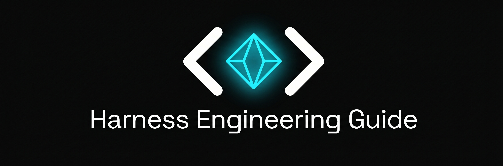

<p align="center">
  <a href="https://harness-guide.com/zh/">
    
  </a>
</p>

<p align="center">
  <em>构建 AI Agent Harness 的实战指南——每篇文章都有可复制运行的真实代码。</em>
</p>

<p align="center">
  <a href="https://github.com/nexu-io/harness-engineering-guide/stargazers"></a>
  <a href="https://github.com/nexu-io/harness-engineering-guide/blob/main/LICENSE"></a>
</p>

<p align="center">
  🌐 <b><a href="https://harness-guide.com/zh/">中文站</a></b> | <a href="https://harness-guide.com">English</a>
</p>

<p align="center">
  <a href="README.md">English</a> | <b>中文</b>
</p>

---

**Harness** 是将裸语言模型变成 **Agent** 的 Runtime 封装层——一个能够感知环境、做出决策、跨多个步骤执行操作的自主系统。Harness 处理模型自身无法完成的一切：执行工具、管理记忆、组装上下文、执行安全边界。

本指南从第一性原理到生产模式覆盖 Harness Engineering，每篇文章都有真实代码。

---

## 入门

| 主题 | 描述 |
|------|------|
| [什么是 Harness？](zh-guide/what-is-harness.md) | 3 分钟理解概念。如何将模型变成 Agent。Harness vs Framework vs Runtime。 |
| [你的第一个 Harness](zh-guide/your-first-harness.md) | 50 行 Python 构建可运行的 Harness。可复制运行的完整代码。 |
| [Harness 与 Framework 的区别](zh-guide/harness-vs-framework.md) | 何时用原始 Harness vs LangChain/CrewAI。决策树 + 代码对比。 |

## 核心概念

| 主题 | 描述 |
|------|------|
| [Agentic Loop](zh-guide/agentic-loop.md) | Think → Act → Observe 循环。Turn 预算、并行 Tool 调用、循环检测、流式传输。 |
| [Tool 系统](zh-guide/tool-system.md) | Tool 注册表、静态 vs 动态加载、MCP 协议、描述质量模式。 |
| [Memory 与 Context](zh-guide/memory-and-context.md) | Context 组装、Session 管理、双层 Memory。AGENTS.md 和 MEMORY.md 模式。 |
| [Guardrails](zh-guide/guardrails.md) | 权限模型、信任边界、沙箱、Prompt 注入防御。 |

## 实战

| 主题 | 描述 |
|------|------|
| [Context 工程](zh-guide/context-engineering.md) | 优先级组装、压缩三道防线、Token 预算。 |
| [Sandbox](zh-guide/sandbox.md) | Docker 和 Firecracker 配置、网络隔离、文件系统限制。 |
| [Skill 系统](zh-guide/skill-system.md) | Skill 打包、按需加载、SKILL.md 格式、薄 Harness + 厚 Skill。 |
| [Sub-Agent](zh-guide/sub-agent.md) | Leader-Worker 模式、文件通信、Session 隔离、并行执行。 |
| [错误处理](zh-guide/error-handling.md) | 错误分类、重试策略、优雅降级、断点续传。 |
| [多 Agent 编排](zh-guide/multi-agent-orchestration.md) | 编排模式（流水线、扇出、监督者），Context 隔离，实战案例（Multica、Paseo、OpenClaw）。 |
| [定时任务与自动化](zh-guide/scheduling-and-automation.md) | Cron、Heartbeat、事件触发。Session 目标、交付、LangSmith vs Harness 原生对比。 |
| [长时运行 Harness 设计](zh-guide/long-running-harness.md) | Context 焦虑、自评估偏差、Reset vs Compaction、GAN 启发的生成器-评估器架构。 |
| [Managed Agents 架构](zh-guide/managed-agents-architecture.md) | Brain/Hands/Session 三层解耦、Pets vs Cattle、凭证隔离、TTFT 改进。 |
| [评测基础设施噪声](zh-guide/eval-infrastructure.md) | 资源配置导致 Benchmark 得分波动 6 个百分点。Floor+Ceiling 执行策略。 |
| [基于分类器的权限审批](zh-guide/classifier-permissions.md) | 用模型分类器替代 approval fatigue。双层防御、四种威胁模型、reasoning-blind 设计。 |
| [Eval Awareness](zh-guide/eval-awareness.md) | Agent 意识到被评估时的行为。新型 contamination、Multi-Agent 放大效应、Harness 防御。 |
| [Agent Teams](zh-guide/agent-teams.md) | 16 个并行 Claude 造 100K 行 C 编译器。Ralph-loop、Git 协调、GCC-as-oracle 二分法。 |
| [Initializer + Coding Agent 模式](zh-guide/initializer-coding-pattern.md) | 长时运行 Agent 的两阶段 Harness。Feature list JSON、启动仪式、Clean state commit。 |

## 参考

| 主题 | 描述 |
|------|------|
| [主流 Harness 实现对比](zh-guide/comparison.md) | OpenClaw、Claude Code、Codex、Cline、Aider、Cursor 并排对比。 |
| [术语表](zh-guide/glossary.md) | 关键术语定义。 |

## 分享

| 主题 | 描述 |
|------|------|
| [Windows 客户端百亿 Token 实战](zh-guide/nexu-windows-packaging.md) | 打包 15min→4min，安装 10min→2min。Electron 打包流水线重建全记录。 |
| [1000+ 幽灵账号盗刷排查实录](zh-guide/ghost-account-hunting.md) | 上线 15 天被盗刷 1000+ 账号的血泪排查全过程。 |

---

## 如何贡献

1. 进入 [**Issues → New Issue**](https://github.com/nexu-io/harness-engineering-guide/issues/new/choose)
2. 选择 **"📬 Submit a Resource"**
3. 填写标题、链接和推荐理由

也可以直接提交 PR——参见 [CONTRIBUTING.md](CONTRIBUTING.md)。

---

## 社区

- 💬 **GitHub Discussions** — [参与讨论](https://github.com/nexu-io/harness-engineering-guide/discussions)
- 🐦 **Twitter** — [@nexudotio](https://x.com/nexudotio)
- 💬 **飞书群** — [加入 Harness Engineering 话题群](https://applink.feishu.cn/client/chat/chatter/add_by_link?link_token=717g465a-0bc8-4242-9281-12b23953491a)

---

## 关于

由 [Nexu](https://github.com/nexu-io) 维护——开源的 Claude Co-worker & Managed Agent 平台。

## 许可证

[MIT License](LICENSE)

---

如果觉得这份指南有用，请考虑给个 ⭐

```
@misc{nexu_harness-engineering-guide_2026,
  author = {Nexu Team},
  title = {Harness Engineering Guide},
  year = {2026},
  publisher = {GitHub},
  howpublished = {\url{https://github.com/nexu-io/harness-engineering-guide}}
}
```
