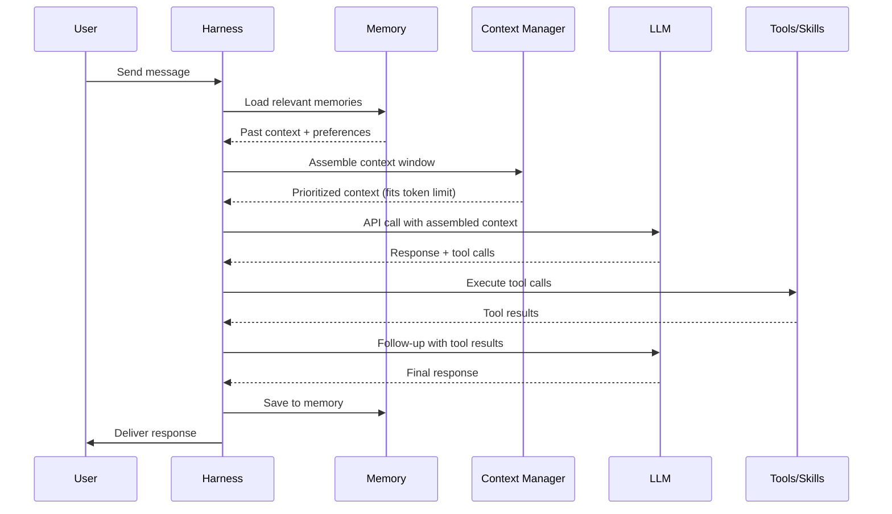
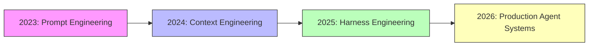

# Introduction to Harness Engineering

## What is a Harness?

A **harness** is the runtime layer that wraps an AI model and turns it into a useful agent. It's everything between the raw LLM API call and the end-user experience:

```
┌─────────────────────────────────────────┐
│              User / Interface            │
├─────────────────────────────────────────┤
│            Agent Harness                 │
│  ┌─────────┬──────────┬──────────────┐  │
│  │ Context │ Memory   │ Skills/Tools │  │
│  │ Mgmt    │ System   │ Orchestration│  │
│  ├─────────┼──────────┼──────────────┤  │
│  │ Safety  │ Lifecycle│ Multi-Agent  │  │
│  │ Layer   │ Mgmt     │ Coordination │  │
│  └─────────┴──────────┴──────────────┘  │
├─────────────────────────────────────────┤
│          Model API (LLM)                 │
│     GPT / Claude / Gemini / OSS          │
└─────────────────────────────────────────┘
```

Think of it this way: if an AI agent were a race car, the model is the engine, but the harness is *everything else* — the chassis, the suspension, the telemetry, the pit stop strategy.

### How a Harness Processes a Single User Request



Every step in this diagram is a design decision. Different harnesses make different choices — and those choices determine the agent's behavior, reliability, and cost.

## Harness vs Runtime vs Framework

These terms are often confused. Here's how we distinguish them:

| Term | Definition | Example |
|------|-----------|---------|
| **Model** | The LLM itself | Claude 4.6, GPT-5, Gemini 2.5 |
| **Framework** | Libraries for building LLM apps | LangChain, LlamaIndex, CrewAI |
| **Runtime** | The execution environment | OpenClaw, Deno, Node.js |
| **Harness** | The complete control layer wrapping a model into an agent | Claude Code (512K lines), Codex harness, OpenClaw agent config |

A **framework** gives you building blocks. A **harness** is the finished product — the specific configuration, memory system, tool set, safety rules, and orchestration logic that makes a model into *your* agent.

### The Key Insight

> Frameworks are shared. Harnesses are owned.

When Harrison Chase says "if you don't own the harness, you don't own the memory," he means: whoever controls the harness controls what the agent remembers, what it can do, and how it behaves.

## Why Harness Engineering Matters

### 1. Models Are Commoditizing

The gap between frontier and open-source models is shrinking. GPT, Claude, Gemini, Llama, Qwen — all can follow instructions, write code, and use tools. The model is becoming a commodity.

What's *not* a commodity: how you wire that model into a workflow, what context you feed it, how it remembers past interactions, and what tools it has access to.

### 2. The Harness Is the Moat

Companies building on raw model APIs have no moat — anyone can switch models. Companies building sophisticated harnesses (context management, persistent memory, domain-specific skills) have real defensibility.

Claude Code's harness is 512K lines. That's not a wrapper — that's a product.

### 3. Harness Engineering Is a Career

Just like "prompt engineering" became a discipline, harness engineering is emerging as a distinct skill set:
- Designing memory architectures (session vs long-term, local vs cloud)
- Building safety and permission systems
- Orchestrating multi-agent workflows
- Optimizing context windows
- Managing agent lifecycle and state

### 4. Historical Inevitability: 30 Years of Taming Complexity

Harness Engineering didn't appear from nowhere. As Huang Jia argues in his comprehensive overview, engineers have always fought system complexity — and the center of that complexity shifts every decade:

| Era | Complexity Center | Landmark | What We Tamed |
|-----|-------------------|----------|---------------|
| 1994 | Objects | GOF "Design Patterns" | Class lifecycle, object collaboration |
| 2002 | Enterprise | Fowler's "PoEAA", Evans' "DDD" | System layering, domain boundaries |
| 2010 | Distribution | Microservices, Kubernetes | Service communication, eventual consistency |
| 2017 | Data | Kleppmann's "DDIA" | Replication, partitioning, consensus |
| **2026** | **Agents** | **Harness Engineering** | **Non-deterministic, autonomous systems** |

The pattern is clear: every ~7 years, what was complex becomes routine, and a new layer of complexity emerges. Agents are the first *non-deterministic* system engineers have had to tame — they're probabilistic machines that don't always follow instructions. **Harness is the reins.**

### 5. Three Leaps: Prompt → Context → Harness

The journey from chatbot to controllable agent happened in three distinct leaps:

| Phase | Period | Core Focus |
|-------|--------|------------|
| Prompt Engineering | 2023 | Making LLMs understand us (CoT, Few-shot) |
| Context Engineering | 2024-2025 | What you feed = what you get (RAG, knowledge bases) |
| **Harness Engineering** | **2026** | Designing controllable systems (loops, tools, quality gates, governance) |



Each stage builds on the last. Prompt engineering optimized the input. Context engineering optimized what surrounds the input. Harness engineering optimizes the entire system that manages the model.

### 6. Open vs Closed Harness

The industry is splitting into two camps:

| | Open Harness | Closed Harness |
|--|-------------|----------------|
| **Example** | OpenClaw, Nexu | Claude Code, Codex |
| **Memory** | User-owned, portable | Platform-owned, locked |
| **Models** | Any model | Vendor-locked |
| **Skills** | Community ecosystem | Vendor-curated |
| **Customization** | Full control | Limited config |

This guide advocates for open harness engineering — not because closed harnesses are bad, but because understanding what's inside the black box makes you a better engineer regardless of which platform you use.

---

*Next: [Core Concepts →](concepts.md)*
