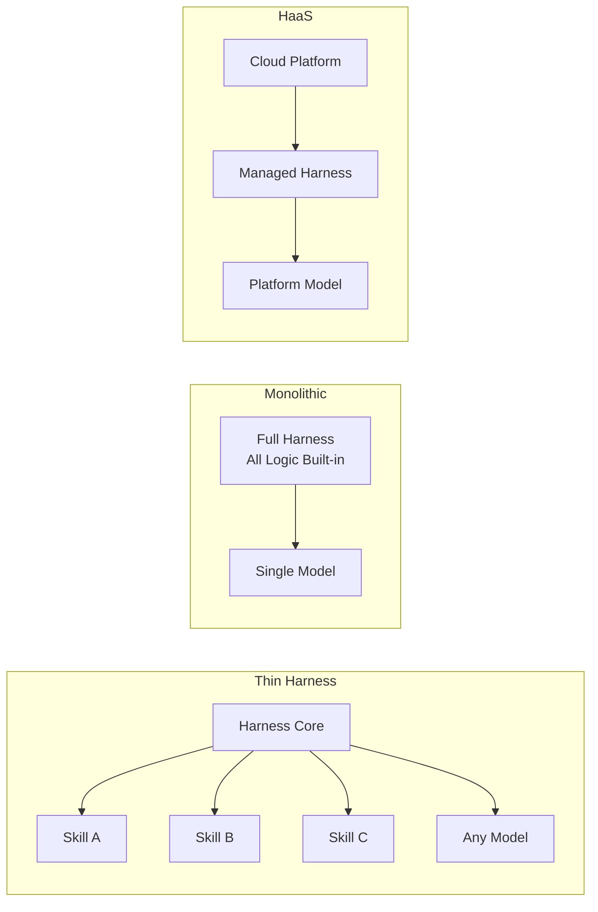

# Architecture Patterns

## Thin Harness + Thick Skills

The harness provides minimal core infrastructure (context management, memory, message routing), while all domain logic lives in modular, installable skills.

```
┌── Harness (thin) ──────────────┐
│  • Message routing              │
│  • Context window management    │
│  • Memory persistence           │
│  • Safety / permission layer    │
│  • Skill discovery & loading    │
└────────────┬───────────────────┘
             │
    ┌────────┼────────┐
    ▼        ▼        ▼
 [Skill A] [Skill B] [Skill C]
  GitHub    Calendar   Deploy
  Ops       Mgmt       Pipeline
```

**Pros:** Modular, community-extensible, model-agnostic
**Cons:** Skill quality varies, coordination complexity
**Examples:** OpenClaw, Nexu

## Monolithic Harness

All agent logic is built into a single, tightly-integrated system.

**Pros:** Deeply optimized, consistent behavior, easier to debug
**Cons:** Vendor lock-in, hard to extend, model-locked
**Examples:** Claude Code, Cursor Agent

## Harness-as-a-Service

The harness runs in the cloud, managed by a platform. Users configure but don't host.

**Pros:** Zero ops, always available, managed scaling
**Cons:** Data leaves your machine, platform dependency
**Examples:** Claude Managed Agent, Codex cloud

### Three Architectures Visualized



## Comparison: Claude Code vs Codex vs OpenClaw

| Dimension | Claude Code | Codex | OpenClaw |
|-----------|------------|-------|----------|
| **Harness size** | ~512K lines | Unknown (closed) | ~50K lines |
| **Model support** | Claude only | GPT only | Any model |
| **Memory** | Platform-managed | Encrypted summaries | User-owned files |
| **Skills** | Built-in tools | Built-in tools | Community skills |
| **Customization** | CLAUDE.md | AGENTS.md (limited) | AGENTS.md + MEMORY.md + Skills |
| **Sandbox** | Docker-based | Cloud sandbox | Local + Docker |
| **Open source** | No (source visible) | No | Yes (MIT) |
| **Multi-agent** | Limited | Yes (Codex tasks) | Yes (sub-agents) |

### Which Pattern Fits?

| If you need... | Choose... |
|----------------|-----------|
| Maximum control & customization | Thin harness (OpenClaw/Nexu) |
| Best single-model experience | Monolithic (Claude Code) |
| Zero setup, cloud-first | HaaS (Managed Agent) |
| Team of agents working together | Thin harness with multi-agent support |

## Multi-Agent Collaboration Patterns

When a single agent can't handle the workload, harnesses support team-based patterns. The learn-claude-code project (S09-S12) demonstrates a progressive approach:

### Leader-Worker Pattern
A "lead" agent creates worker agents, each with their own independent loop and context. The lead delegates tasks; workers execute and report back through a message inbox system.

### Communication: File-Folder Inbox
Each agent gets a dedicated folder as its inbox. Before each LLM call, the harness checks the inbox and injects new messages into context. Simple, debuggable, and filesystem-native.

### Graceful Lifecycle: Request-Response + Unique ID
All coordination uses a single pattern:
- **Shutdown**: Leader sends request (with ID) → Worker finishes current work → Replies with same ID
- **Approval**: Worker submits plan (with ID) → Leader reviews → Replies approve/reject with same ID

This pattern handles any scenario that requires negotiation.

### Autonomous Task Claiming
Idle workers poll a shared task board every N seconds. If a task is available and unblocked, they claim it and start working. After 60 seconds of inactivity with no available tasks, they self-terminate. This eliminates the need for centralized task assignment.

### Workspace Isolation: Git Worktree
Each task gets its own `git worktree` — an independent branch and working directory. Tasks control "what to do," worktrees control "where to do it," linked by task ID. This prevents file conflicts between concurrent agents and enables clean rollbacks.

---

*Next: [Memory Systems →](memory.md)*
